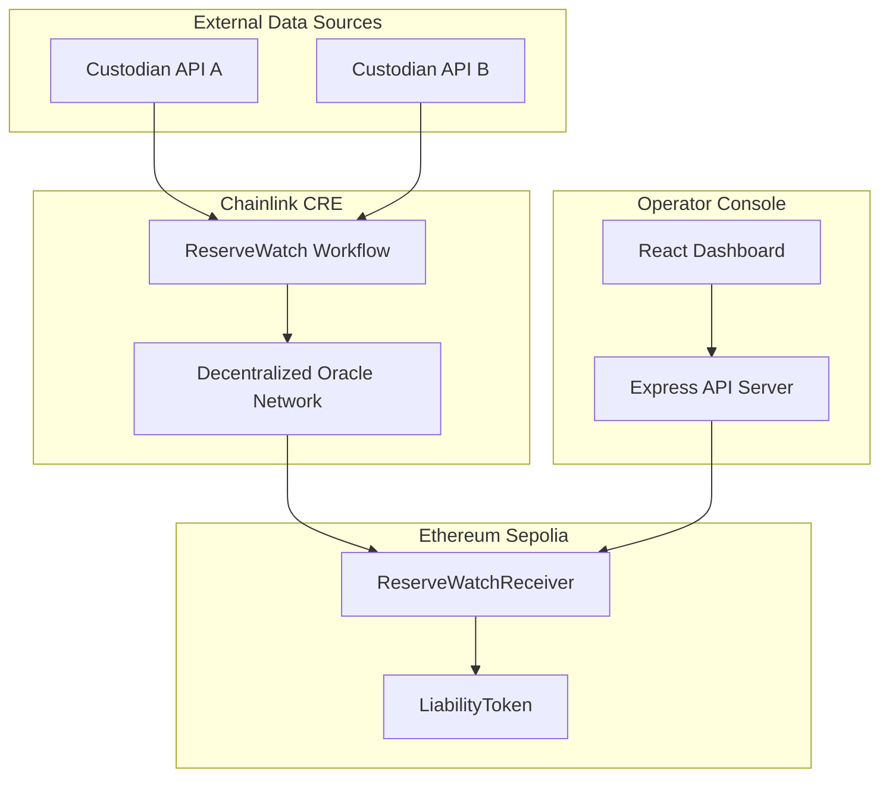
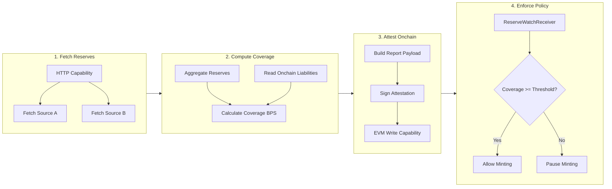
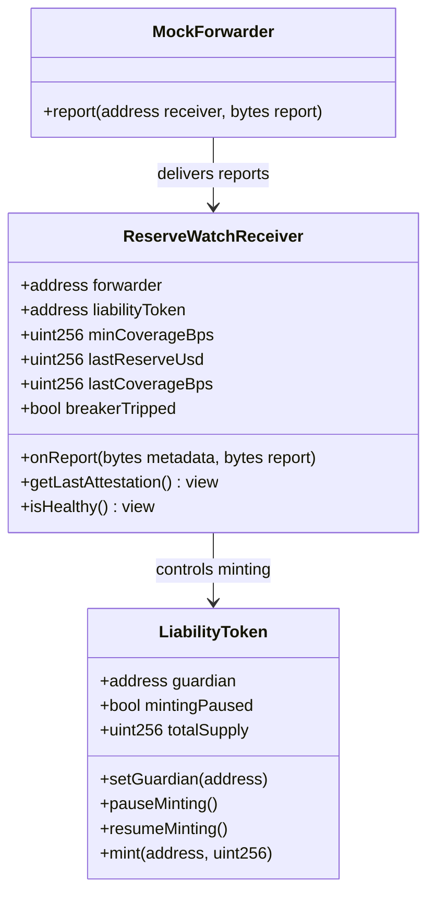
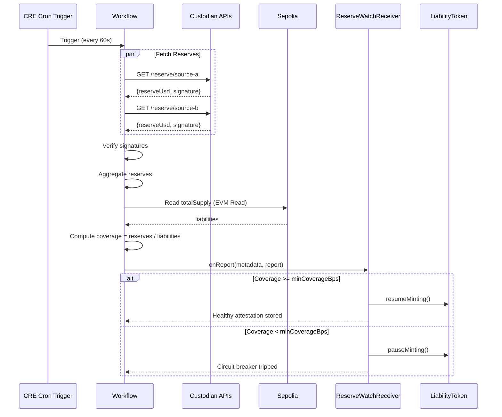
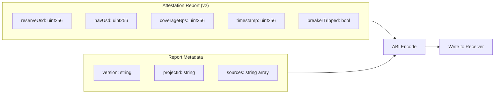
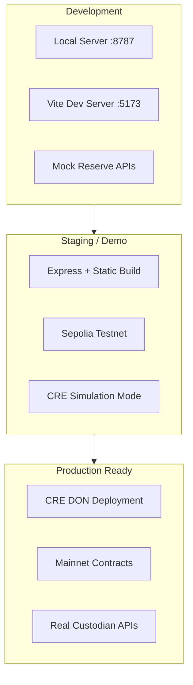
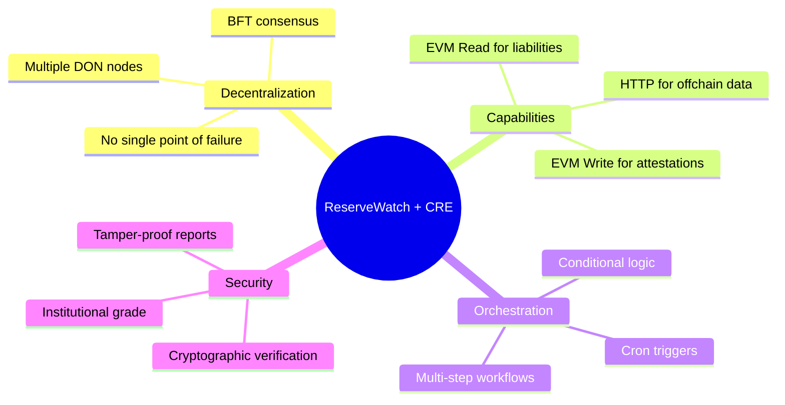

# ReserveWatch Architecture

> Detailed system architecture and data flow diagrams for ReserveWatch

## System Overview



## CRE Workflow Pipeline



## Smart Contract Architecture



## Data Flow Sequence



## Console Architecture

```mermaid
flowchart TB
    subgraph Frontend["React Frontend"]
        LP[Landing Page]
        DB[Dashboard]
        
        subgraph Tabs["Dashboard Tabs"]
            OV[Overview Tab]
            SR[Sources Tab]
            OC[Onchain Tab]
            HI[History Tab]
            ST[Settings Tab]
        end

        LP --> DB
        DB --> Tabs
    end

    subgraph Backend["Express Server"]
        SRV[Server]
        
        subgraph APIs["API Endpoints"]
            AS[/api/status]
            AH[/api/history]
            AP[/api/projects]
        end

        subgraph Admin["Admin Endpoints"]
            AM[/admin/mode]
            AI[/admin/incident]
        end

        SRV --> APIs
        SRV --> Admin
    end

    subgraph Data["Data Sources"]
        PJ[projects.json]
        BC[Blockchain RPC]
    end

    Frontend --> Backend
    Backend --> Data
```

## Attestation Report Format



## Deployment Architecture



## Why Chainlink CRE?



---

Built for **Chainlink CRE Hackathon 2026**
