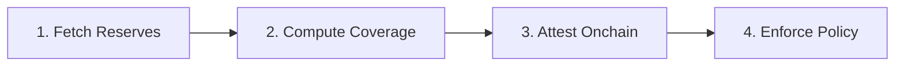

# ReserveWatch

> **Chainlink CRE Hackathon 2026**

Real-time Proof of Reserves monitoring with automatic onchain enforcement for tokenized assets.

   

**[Architecture Diagrams](./ARCHITECTURE.md)** | **[Demo Runbook](./DEMO.md)** | **[CRE Research](./docs/cre-research-notes.md)**

## Overview

ReserveWatch is an institutional-grade Proof of Reserves (PoR) and Net Asset Value (NAV) monitoring system for tokenized RWAs. It uses **Chainlink Compute Runtime Environment (CRE)** to orchestrate automated reserve verification and enforcement.

### Key Features

- **📊 Multi-Source Verification** — Aggregate reserve data from multiple independent sources with cryptographic signature verification
- **⚡ CRE-Powered Workflow** — Chainlink CRE fetches offchain reserves, computes coverage ratios, and writes attestations onchain
- **🛡️ Automatic Circuit Breaker** — If reserves fall below threshold, minting is automatically paused to protect token holders

### How It Works



| Step | Description |
|------|-------------|
| **Fetch Reserves** | CRE workflow fetches reserve balances from custodian APIs |
| **Compute Coverage** | Calculate coverage ratio: reserves / liabilities (in basis points) |
| **Attest Onchain** | Signed attestation written to ReserveWatchReceiver contract |
| **Enforce Policy** | If coverage < threshold, circuit breaker pauses token minting |

> See [ARCHITECTURE.md](./ARCHITECTURE.md) for detailed Mermaid diagrams

## Tech Stack

| Component | Technology |
|-----------|------------|
| Workflow Engine | Chainlink CRE (Compute Runtime Environment) |
| Smart Contracts | Solidity 0.8.x |
| Network | Ethereum Sepolia |
| Frontend | React 18 + Vite |
| Server | Node.js + Express |

## Repository Layout

| Directory | Description |
|-----------|-------------|
| `console/` | React 18 + Vite operator console with dark theme |
| `contracts/evm/` | Solidity smart contracts (ReserveWatchReceiver, LiabilityToken) |
| `contracts/abi/` | TypeScript ABIs for workflow integration |
| `reservewatch-workflow/` | CRE TypeScript workflow (main.ts, workflow.yaml) |
| `server/` | Express API server + static console hosting |
| `docs/` | Research notes and contract gap analysis |
| `scripts/` | Demo runner and deployment scripts |

## Target Chain
- Ethereum Sepolia (Chainlink CRE default)

## Quick Start

### 1. Install Dependencies

```bash
# Server
cd server && npm install

# Console (React frontend)
cd console && npm install

# Workflow
cd reservewatch-workflow && npm install
```

### 2. Start the Server

```bash
cd server && npm start
# Server runs at http://127.0.0.1:8787
```

### 3. Open the Console

Navigate to: **http://127.0.0.1:8787/console**

You'll see:
1. **Landing Page** — Project overview and "Enter Dashboard" button
2. **Dashboard** — Live status, tabs for Overview/Sources/Onchain/History/Settings

### 4. Deploy Contracts (Optional)

```bash
cd contracts/evm && node deploy.js
```

This deploys `LiabilityToken` and `ReserveWatchReceiver` to Sepolia and updates config files.

### 5. Run CRE Workflow

```bash
# End-to-end demo (recommended)
node scripts/demo.mjs --broadcast --api http://127.0.0.1:8787 --project reservewatch-sepolia

# Manual single run
cre workflow simulate reservewatch-workflow --target staging-settings --broadcast --env .env
```

## Local run (simulation)

### 1) Reserve API (external data source)
- Run the server from `server/`
- Default mode is `healthy` (can be switched to `unhealthy`)

Start:
- `cd server && npm start`

Endpoints:
- `GET http://127.0.0.1:8787/reserve/source-a`
- `GET http://127.0.0.1:8787/reserve/source-b`
- `POST http://127.0.0.1:8787/admin/mode` with JSON: `{ "mode": "healthy" | "unhealthy" }`

Incident monitoring (optional):
- `GET http://127.0.0.1:8787/incident/feed?project=<id>`
- `POST http://127.0.0.1:8787/admin/incident`

Reserve payloads include:
- `reserveUsd` (required)
- `navUsd` (optional)
- `signer` + `signature` (optional, when `RESERVE_SIGNING_PRIVATE_KEY` is set)

Console + API:
- `GET http://127.0.0.1:8787/console`
- `GET http://127.0.0.1:8787/api/status?project=<id>`
- `GET http://127.0.0.1:8787/api/history?project=<id>&limit=10`

### 2) Deploy contracts for simulation
CRE simulation uses a **MockForwarder**. For Ethereum Sepolia, the docs reference:

- MockForwarder: `0x15fC6ae953E024d975e77382eEeC56A9101f9F88`

Deploy order:
1. Deploy `LiabilityToken`
2. Deploy `ReserveWatchReceiver(forwarder, liabilityToken, minCoverageBps)`
3. Set token guardian to the receiver (`LiabilityToken.setGuardian(receiver)`)

If you use `contracts/evm/deploy.js`, it will also update:
- `reservewatch-workflow/config.staging.json` (addresses + `attestationVersion`)
- `server/projects.json` (addresses for `reservewatch-sepolia`)

### 3) Configure workflow
Edit:
- `reservewatch-workflow/config.staging.json`

Set:
- `receiverAddress` to the deployed `ReserveWatchReceiver`
- `liabilityTokenAddress` to the deployed `LiabilityToken`

Optional:
- `attestationVersion`: `v1` (no NAV onchain) or `v2` (publish NAV onchain)

EVM read policy (optional):
- `evmReadBlockTag`: `finalized` (default) or `latest`
- `evmReadFallbackToLatest`: `true` (default) to retry reads against the other tag if the primary returns empty data
- `evmReadRetries`: number of extra attempts per block tag (string)

### 4) Run CRE simulation
From the repo root:

- Ensure `.env` contains a funded Sepolia private key:
  - `CRE_ETH_PRIVATE_KEY=...`

- Recommended (end-to-end demo runner):
  - `node scripts/demo.mjs --broadcast --api http://127.0.0.1:8787 --project reservewatch-sepolia --timeout 120`

- Manual (single run):
  - `cre workflow simulate reservewatch-workflow --target staging-settings --broadcast --env .env`

If you have a proxy configured in your shell environment, you may need:
- `curl --noproxy '*' ...`

## Why Chainlink CRE?

| Benefit | How ReserveWatch Uses It |
|---------|--------------------------|
| **Decentralization** | Multiple DON nodes verify reserve data with BFT consensus |
| **HTTP Capability** | Fetch reserve balances from offchain custodian APIs |
| **EVM Read** | Read token supply (liabilities) directly from chain |
| **EVM Write** | Write signed attestations to receiver contract |
| **Cron Triggers** | Automated 60-second monitoring interval |
| **Institutional Grade** | Cryptographic verification and tamper-proof reports |

## Chainlink CRE Integration

### Files That Use Chainlink

| File | Purpose | Chainlink Components Used |
|------|---------|---------------------------|
| [`reservewatch-workflow/main.ts`](./reservewatch-workflow/main.ts) | Core workflow logic | `@chainlink/cre-sdk`: CronCapability, EVMClient, HTTPClient, Runner, handler |
| [`reservewatch-workflow/workflow.yaml`](./reservewatch-workflow/workflow.yaml) | CRE workflow configuration | Workflow triggers, capabilities, settings |
| [`project.yaml`](./project.yaml) | RPC and chain configuration | Network settings for CRE |
| [`contracts/evm/src/ReserveWatchReceiver.sol`](./contracts/evm/src/ReserveWatchReceiver.sol) | Receives CRE attestations | Implements `onReport()` for DON reports |
| [`contracts/abi/ReserveWatchReceiver.ts`](./contracts/abi/ReserveWatchReceiver.ts) | ABI for workflow | Used by CRE workflow for EVM calls |
| [`contracts/abi/LiabilityToken.ts`](./contracts/abi/LiabilityToken.ts) | ABI for workflow | Used by CRE workflow for EVM reads |

## Smart Contracts

| Contract | Description |
|----------|-------------|
| `ReserveWatchReceiver.sol` | Receives attestations, enforces circuit breaker |
| `LiabilityToken.sol` | ERC-20 token with guardian-controlled minting |

## API Endpoints

| Endpoint | Method | Description |
|----------|--------|-------------|
| `/console` | GET | Operator console UI |
| `/api/status` | GET | Current health and onchain state |
| `/api/history` | GET | Recent attestation events |
| `/api/projects` | GET | List configured projects |
| `/admin/mode` | POST | Toggle healthy/unhealthy mode (demo) |
| `/admin/incident` | POST | Set incident alert (demo) |

## License

MIT

---

Built for **Chainlink CRE Hackathon 2026**
